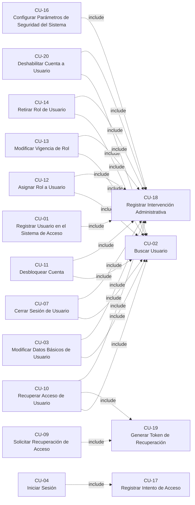

# Sistema de acceso a servicios universitarios

Informe del caso: análisis de requerimientos, casos de uso, diseño y prototipo.

## Documentos generales

- [Datos del informe](informe.md)
- [Requisitos por caso](requisitos.md)
- [Actores](actores.md)
- [Reglas de negocio](reglas-de-negocio.md)
- [Matriz de trazabilidad](matriz-trazabilidad.md)

## Diseño

- [Diagramas de casos de uso](diseno/diagramas-casos-de-uso.md)
- [Diagramas de robustez](diseno/diagramas-robustez.md)
- [Prototipo](diseno/prototipo.md)
- [Secciones del Word sin contenido todavía](diseno/pendientes-del-word.md)

## Casos de uso

| CU | Nombre | Actor(es) | Tipo |
| --- | --- | --- | --- |
| [CU-01](casos-de-uso/CU-01-registrar-usuario-en-el-sistema-de-acceso.md) | Registrar Usuario en el Sistema de Acceso | Administrador del sistema | Principal |
| [CU-02](casos-de-uso/CU-02-buscar-usuario.md) | Buscar Usuario | Administrador del sistema | Principal |
| [CU-03](casos-de-uso/CU-03-modificar-datos-basicos-de-usuario.md) | Modificar Datos Básicos de Usuario | Administrador del sistema | Principal |
| [CU-04](casos-de-uso/CU-04-iniciar-sesion.md) | Iniciar Sesión | Estudiante, Docente, Trabajador administrativo | Principal |
| [CU-05](casos-de-uso/CU-05-cerrar-sesion.md) | Cerrar Sesión | Estudiante, Docente, Trabajador administrativo | Principal |
| [CU-06](casos-de-uso/CU-06-cerrar-sesion-por-inactividad.md) | Cerrar Sesión por Inactividad | Sistema | Principal |
| [CU-07](casos-de-uso/CU-07-cerrar-sesion-de-usuario.md) | Cerrar Sesión de Usuario | Administrador del sistema | Principal |
| [CU-08](casos-de-uso/CU-08-cambiar-contrasena.md) | Cambiar Contraseña | Estudiante, Docente, Trabajador administrativo | Principal |
| [CU-09](casos-de-uso/CU-09-solicitar-recuperacion-de-acceso.md) | Solicitar Recuperación de Acceso | Estudiante, Docente, Trabajador administrativo | Principal |
| [CU-10](casos-de-uso/CU-10-recuperar-acceso-de-usuario.md) | Recuperar Acceso de Usuario | Administrador del sistema | Principal |
| [CU-11](casos-de-uso/CU-11-desbloquear-cuenta.md) | Desbloquear Cuenta | Administrador del sistema, Área de seguridad | Principal |
| [CU-12](casos-de-uso/CU-12-asignar-rol-a-usuario.md) | Asignar Rol a Usuario | Administrador del sistema | Principal |
| [CU-13](casos-de-uso/CU-13-modificar-vigencia-de-rol.md) | Modificar Vigencia de Rol | Administrador del sistema | Principal |
| [CU-14](casos-de-uso/CU-14-retirar-rol-de-usuario.md) | Retirar Rol de Usuario | Administrador del sistema | Principal |
| [CU-15](casos-de-uso/CU-15-consultar-bitacora-de-auditoria-e-historial.md) | Consultar Bitácora de Auditoría e Historial | Área de seguridad, Administrador del sistema | Principal |
| [CU-16](casos-de-uso/CU-16-configurar-parametros-de-seguridad-del-sistema.md) | Configurar Parámetros de Seguridad del Sistema | Área de seguridad | Principal |
| [CU-17](casos-de-uso/CU-17-registrar-intento-de-acceso.md) | Registrar Intento de Acceso | Ninguno | «include» |
| [CU-18](casos-de-uso/CU-18-registrar-intervencion-administrativa.md) | Registrar Intervención Administrativa | Ninguno | «include» |
| [CU-19](casos-de-uso/CU-19-generar-token-de-recuperacion.md) | Generar Token de Recuperación | Ninguno | «include» |
| [CU-20](casos-de-uso/CU-20-deshabilitar-cuenta-a-usuario.md) | Deshabilitar Cuenta a Usuario | Administrador del sistema | Principal |

## Relaciones «include»

| Caso de uso | Incluye |
| --- | --- |
| CU-01 | CU-18 |
| CU-03 | CU-02, CU-18 |
| CU-04 | CU-17 |
| CU-07 | CU-02, CU-18 |
| CU-09 | CU-19 |
| CU-10 | CU-02, CU-19, CU-18 |
| CU-11 | CU-02, CU-18 |
| CU-12 | CU-02, CU-18 |
| CU-13 | CU-02, CU-18 |
| CU-14 | CU-02, CU-18 |
| CU-16 | CU-18 |
| CU-20 | CU-02, CU-18 |

