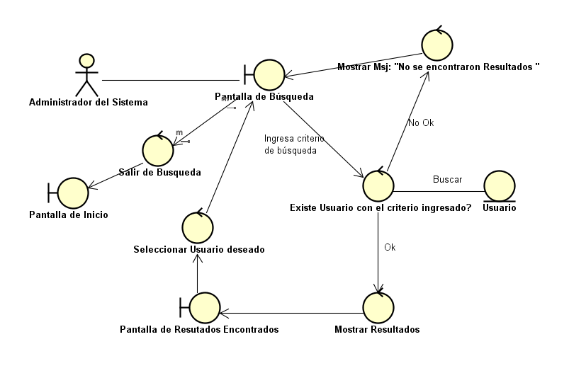
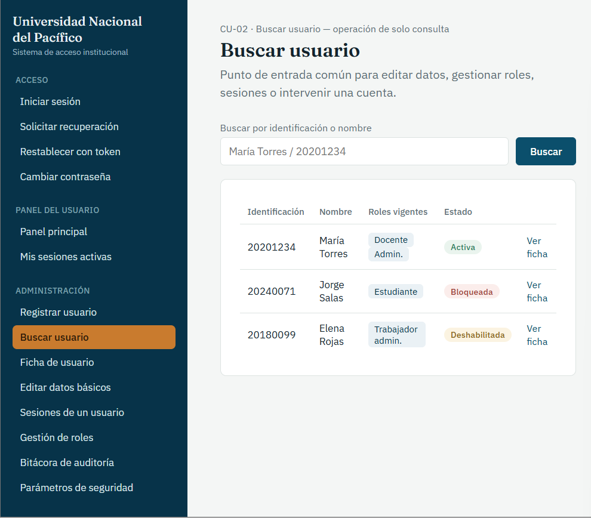
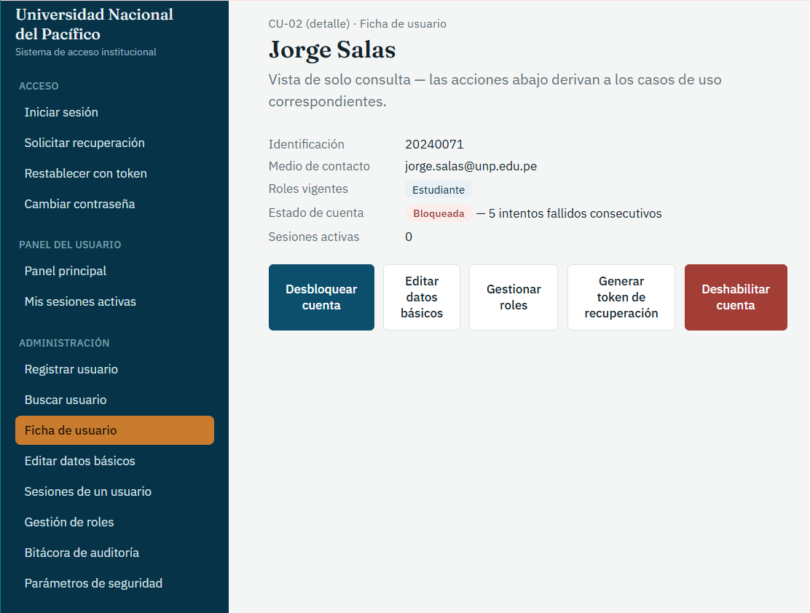

# CU-02: Buscar Usuario

Caso de uso principal

## Actor(es)

Administrador del sistema

## Precondición

El administrador necesita ubicar a un usuario registrado en el sistema, ya sea como consulta directa o como paso previo de otro caso de uso.

## Flujo principal

1. El administrador ingresa un criterio de búsqueda (identificación, nombre u otro dato disponible).
2. El sistema busca coincidencias entre los usuarios registrados.
3. El sistema muestra el resultado: identificación básica, roles vigentes, estado de la cuenta (activa/bloqueada) y sesiones activas del usuario (RF-32).
4. El administrador selecciona al usuario sobre el cual continuará su gestión (editar, asignar/retirar rol, cerrar sesión, desbloquear cuenta, etc.).

## Flujos alternativos

### A. Ningún usuario coincide con el criterio

1. El sistema determina que no existe ningún usuario que coincida con el criterio de búsqueda.
2. El sistema informa al administrador que no se encontraron resultados.

## Postcondición

El administrador obtiene la información del usuario solicitado. La búsqueda es de solo consulta y no modifica ningún dato del usuario (RN-18).

## Relaciones

**Incluido por:** [CU-03: Modificar Datos Básicos de Usuario](CU-03-modificar-datos-basicos-de-usuario.md), [CU-07: Cerrar Sesión de Usuario](CU-07-cerrar-sesion-de-usuario.md), [CU-10: Recuperar Acceso de Usuario](CU-10-recuperar-acceso-de-usuario.md), [CU-11: Desbloquear Cuenta](CU-11-desbloquear-cuenta.md), [CU-12: Asignar Rol a Usuario](CU-12-asignar-rol-a-usuario.md), [CU-13: Modificar Vigencia de Rol](CU-13-modificar-vigencia-de-rol.md), [CU-14: Retirar Rol de Usuario](CU-14-retirar-rol-de-usuario.md), [CU-20: Deshabilitar Cuenta a Usuario](CU-20-deshabilitar-cuenta-a-usuario.md)

## Requisitos y reglas que cubre

| Código | Descripción |
| --- | --- |
| RF-32 | El sistema debe permitir que el administrador busque y consulte la información de un usuario: identificación, roles vigentes, estado de la cuenta y sesiones activas. |
| RN-18 | La búsqueda de un usuario es una operación de solo consulta: no modifica ningún dato del usuario ni de sus sesiones, roles o historial. |

## Diseño

### Diagrama de robustez

### Prototipo

*Buscar usuario.* Búsqueda por identificación o nombre; tabla con roles vigentes y estado de la cuenta.

*Ficha de usuario.* Datos del usuario en solo consulta y acciones derivadas: desbloquear cuenta (CU-11), editar datos básicos (CU-03), gestionar roles (CU-12/13/14), generar token de recuperación (CU-10) y deshabilitar cuenta (CU-20).

---
[← Volver al índice](../00-indice.md)
