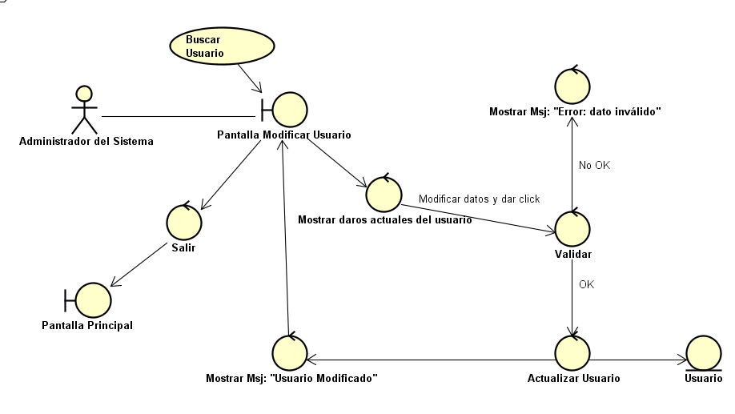
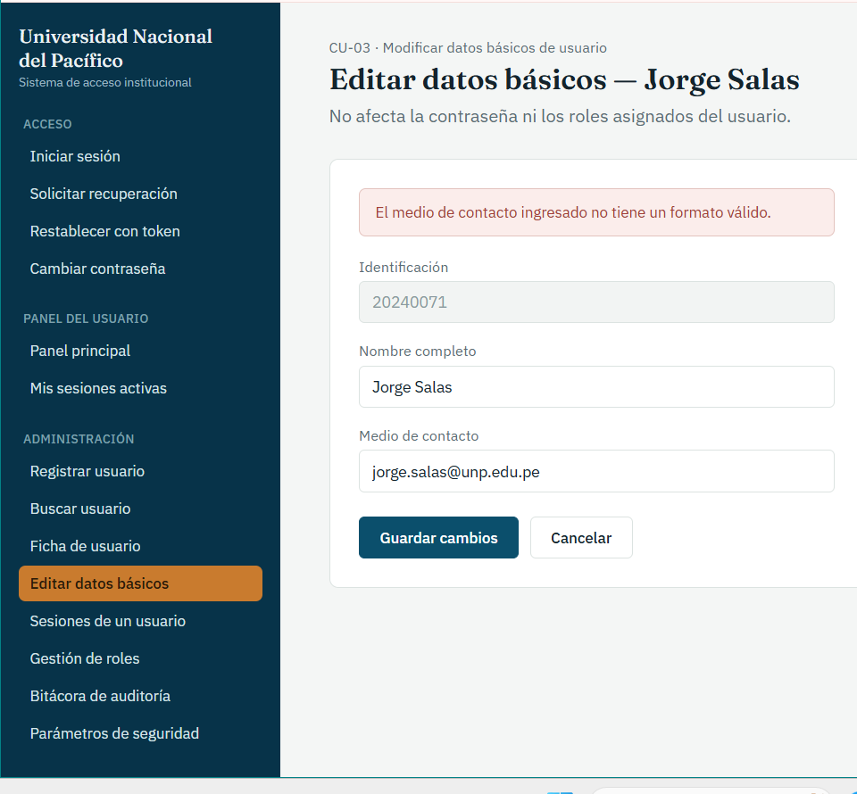

# CU-03: Modificar Datos Básicos de Usuario

Caso de uso principal

## Actor(es)

Administrador del sistema

## Precondición

El usuario ya se encuentra registrado en el sistema (CU-01).

## Flujo principal

1. El administrador incluye el caso de uso CU-02 (Buscar Usuario) para ubicar al usuario a modificar.
2. El sistema muestra los datos básicos actuales del usuario (identificación, medio de contacto).
3. El administrador modifica el dato requerido (por ejemplo, el medio de contacto).
4. El sistema valida el nuevo valor ingresado.
5. El sistema actualiza los datos básicos del usuario, sin afectar su contraseña ni sus roles asignados (RF-33).
6. El sistema incluye el caso de uso CU-18 (Registrar Intervención Administrativa).
7. El sistema confirma la actualización al administrador.

## Flujos alternativos

### A. Dato inválido

1. El sistema determina que el nuevo valor no cumple el formato esperado (por ejemplo, un medio de contacto inválido).
2. El sistema rechaza la actualización.
3. El sistema informa al administrador el motivo del rechazo.

## Postcondición

Los datos básicos del usuario quedan actualizados. La contraseña, los roles asignados y el historial del usuario permanecen sin cambios.

## Relaciones

**Incluye:** [CU-02: Buscar Usuario](CU-02-buscar-usuario.md), [CU-18: Registrar Intervención Administrativa](CU-18-registrar-intervencion-administrativa.md)

## Requisitos y reglas que cubre

| Código | Descripción |
| --- | --- |
| RF-33 | El sistema debe permitir que el administrador modifique los datos básicos de identificación de un usuario (por ejemplo, su medio de contacto), sin afectar su contraseña ni sus roles asignados. |

## Diseño

### Diagrama de robustez

### Prototipo

*Editar datos básicos.* Identificación (solo lectura), nombre y medio de contacto; muestra el aviso de formato inválido.

---
[← Volver al índice](../00-indice.md)
