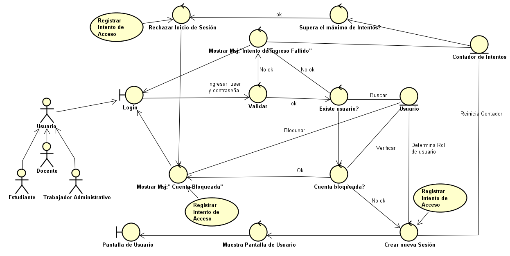
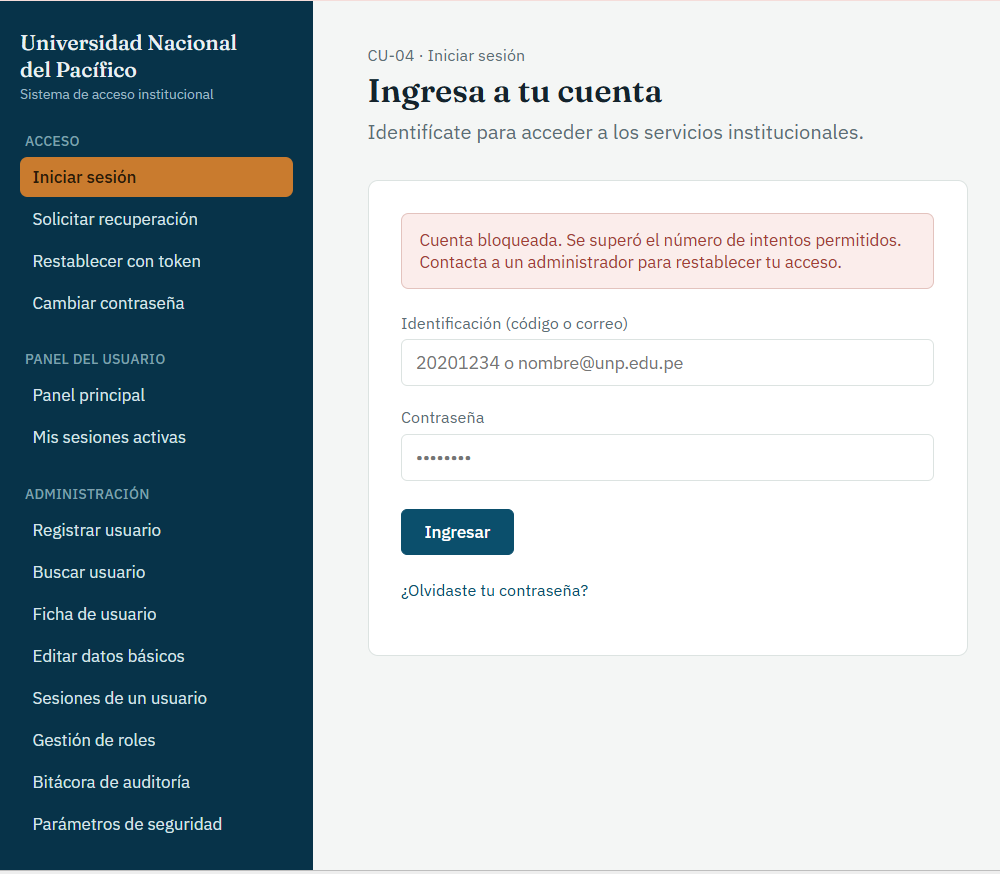
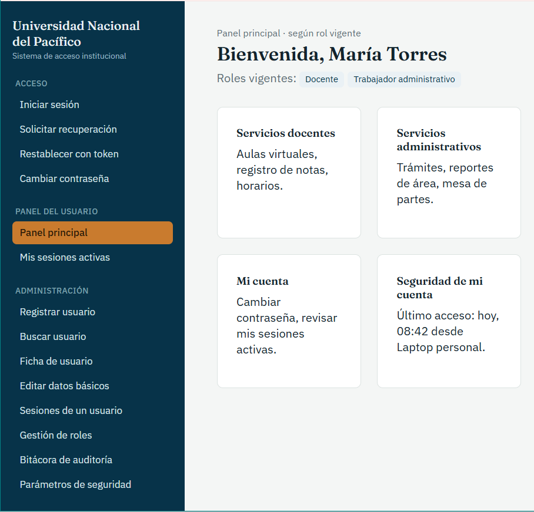

# CU-04: Iniciar Sesión

Caso de uso principal

## Actor(es)

Estudiante, Docente, Trabajador administrativo

## Precondición

El usuario se encuentra registrado en el sistema (CU-01) e ingresa a la pasarela de acceso.

## Flujo principal

1. El usuario proporciona la información requerida para identificarse.
2. El sistema verifica que la cuenta no se encuentre bloqueada.
3. El sistema valida la información proporcionada.
4. El sistema incluye el caso de uso CU-17 (Registrar Intento de Acceso) con resultado exitoso.
5. El sistema reinicia el contador de intentos fallidos del usuario (RF-03).
6. El sistema crea una nueva sesión para el acceso actual, independiente de las demás sesiones del usuario.
7. El sistema determina los roles vigentes del usuario en ese momento (RF-24).
8. El sistema permite el acceso al servicio solicitado de acuerdo con los permisos correspondientes a los roles vigentes.

## Flujos alternativos

### A. Credenciales incorrectas

1. El sistema determina que la información proporcionada no es válida.
2. El sistema incrementa el contador de intentos fallidos.
3. El sistema incluye el caso de uso CU-17 (Registrar Intento de Acceso) con resultado rechazado.
4. Si el contador alcanza el límite máximo permitido, el sistema cambia el estado de la cuenta a "Bloqueada".
5. El sistema informa al usuario el resultado del intento.
6. Si la cuenta fue bloqueada, finaliza el caso de uso.

### B. Cuenta bloqueada

1. El sistema verifica que la cuenta se encuentra en estado "Bloqueada".
2. El sistema rechaza el intento de acceso.
3. El sistema incluye el caso de uso CU-17 (Registrar Intento de Acceso) con resultado rechazado por bloqueo.
4. El sistema informa al usuario que la cuenta se encuentra bloqueada.
5. Finaliza el caso de uso.

## Postcondición

El usuario queda autenticado y dispone de una sesión activa asociada al acceso actual, con las opciones correspondientes a sus roles vigentes. El intento de autenticación queda registrado y, si fue exitoso, el contador de intentos fallidos se reinicia.

## Relaciones

**Incluye:** [CU-17: Registrar Intento de Acceso](CU-17-registrar-intento-de-acceso.md)

## Requisitos y reglas que cubre

| Código | Descripción |
| --- | --- |
| RF-01 | Limitar los intentos de autenticación fallidos y bloquear el acceso al superar el límite configurado. |
| RF-03 | Un inicio de sesión exitoso reinicia el contador de intentos fallidos. |
| RF-05 | Permitir sesiones activas simultáneas del mismo usuario en distintos equipos, cada una independiente de las demás. |
| RF-20 | Otorgar permisos distintos según el tipo de usuario (estudiante, docente, administrativo). |
| RF-24 | Determinar las opciones disponibles para el usuario en cada acceso según sus roles vigentes en ese momento. |

## Diseño

### Diagrama de robustez

### Prototipo

*Iniciar sesión.* Formulario de identificación y contraseña; se muestra el aviso de cuenta bloqueada al superar el número de intentos permitidos.

*Panel principal según rol vigente.* Muestra los roles vigentes del usuario y las opciones de servicio que le corresponden (RF-24).

---
[← Volver al índice](../00-indice.md)
