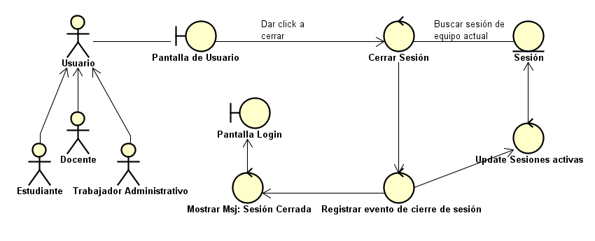

# CU-05: Cerrar Sesión

Caso de uso principal

## Actor(es)

Estudiante, Docente, Trabajador administrativo

## Precondición

El usuario tiene una sesión activa en el equipo que está utilizando (RF-07).

## Flujo principal

1. El usuario solicita cerrar la sesión activa en el equipo actual.
2. El sistema invalida únicamente la sesión correspondiente al equipo actual.
3. Las demás sesiones activas del usuario, si existen, permanecen vigentes (RN-03, RN-16).
4. El sistema registra el evento de cierre de sesión.
5. El sistema confirma al usuario que la sesión fue cerrada.

## Postcondición

La sesión del equipo actual queda invalidada. Las demás sesiones del usuario permanecen sin modificaciones.

## Requisitos y reglas que cubre

| Código | Descripción |
| --- | --- |
| RF-07 | Permitir que el propio usuario cierre manualmente la sesión del equipo que está utilizando, sin afectar sus otras sesiones activas. |
| RN-03 | Cada equipo o dispositivo genera una sesión propia; las sesiones son independientes entre sí. |
| RN-16 | Una sesión solo puede finalizar por tres vías excluyentes entre sí: expiración por inactividad, cierre voluntario del propio usuario, o cierre por intervención de un administrador autorizado. |

## Diseño

### Diagrama de robustez

### Prototipo

*Mis sesiones activas.* Sesiones por equipo con última actividad y estado; permite cerrar las otras sesiones sin afectar la actual (RF-05 a RF-07).

---
[← Volver al índice](../00-indice.md)
