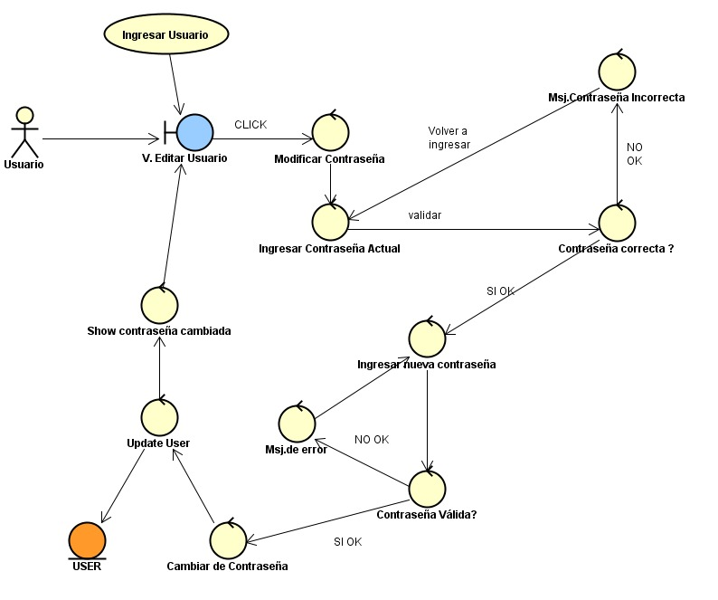
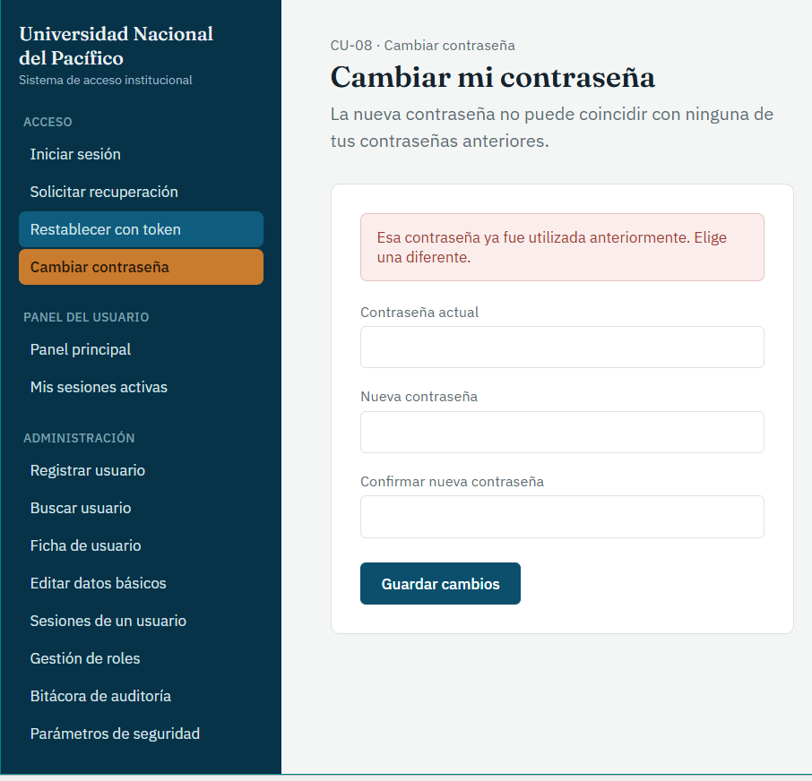

# CU-08: Cambiar Contraseña

Caso de uso principal

## Actor(es)

Estudiante, Docente, Trabajador administrativo (usuario autenticado)

## Precondición

El usuario ha iniciado sesión correctamente.

## Flujo principal

1. El usuario solicita el cambio de contraseña e ingresa su contraseña actual y la nueva contraseña deseada.
2. El sistema valida que la nueva contraseña cumpla con las políticas de complejidad (longitud, caracteres especiales).
3. El sistema consulta el historial cifrado de credenciales anteriores del usuario, según la cantidad configurada (RF-14, RF-30).
4. El sistema verifica que la nueva contraseña no coincida con ningún valor utilizado previamente.
5. El sistema registra la contraseña actual en el historial cifrado y actualiza la contraseña activa.
6. El sistema confirma al usuario la actualización exitosa.

## Flujos alternativos

### A. Contraseña actual inválida

1. El sistema determina que la contraseña actual proporcionada no es válida.
2. El sistema rechaza la solicitud de modificación.
3. El sistema informa al usuario que la contraseña actual es incorrecta.
4. El sistema finaliza el caso de uso sin modificar la contraseña vigente.

### B. Nueva contraseña no cumple con las reglas de seguridad

1. El sistema determina que la nueva contraseña no cumple con las reglas establecidas.
2. El sistema rechaza la nueva contraseña.
3. El sistema informa al usuario que debe proporcionar una contraseña que cumpla las reglas de seguridad.
4. El usuario puede proporcionar una nueva contraseña.

### C. Nueva contraseña utilizada anteriormente

1. El sistema determina que la nueva contraseña ya se encuentra registrada en el historial.
2. El sistema rechaza la nueva contraseña.
3. El sistema informa al usuario que no puede reutilizar una contraseña anterior.
4. El usuario debe proporcionar una contraseña diferente.

## Postcondición

La nueva contraseña queda establecida como vigente y la contraseña anterior queda registrada en el historial correspondiente. Si la operación es rechazada, la contraseña vigente permanece sin modificaciones.

## Requisitos y reglas que cubre

| Código | Descripción |
| --- | --- |
| RF-12 | Permitir modificar la contraseña de autenticación. |
| RF-13 | No permitir reutilizar las contraseñas anteriormente utilizadas. |
| RF-14 | La cantidad de contraseñas históricas consideradas para el rechazo por reutilización debe ser configurable por el área de seguridad. |
| RNF-02 | Aplicar reglas de seguridad al definir una nueva contraseña. |
| RNF-03 | El historial de credenciales debe estar encapsulado y no visible a otros componentes. |

## Diseño

### Diagrama de robustez

### Prototipo

*Cambiar mi contraseña.* Contraseña actual, nueva y confirmación; muestra el aviso de contraseña ya utilizada anteriormente.

---
[← Volver al índice](../00-indice.md)
