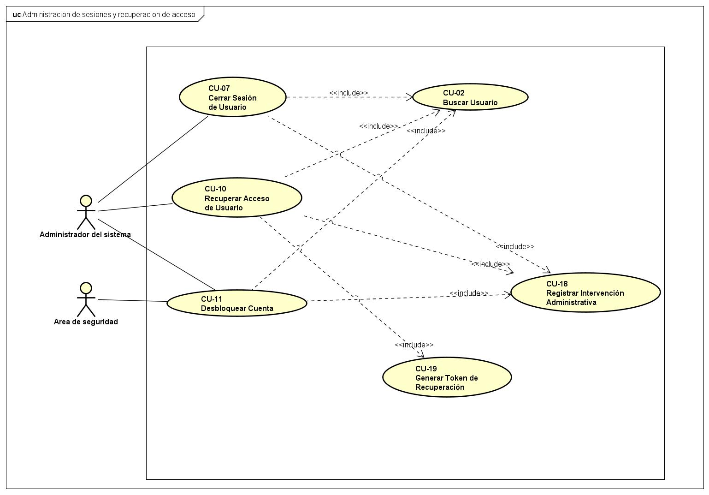
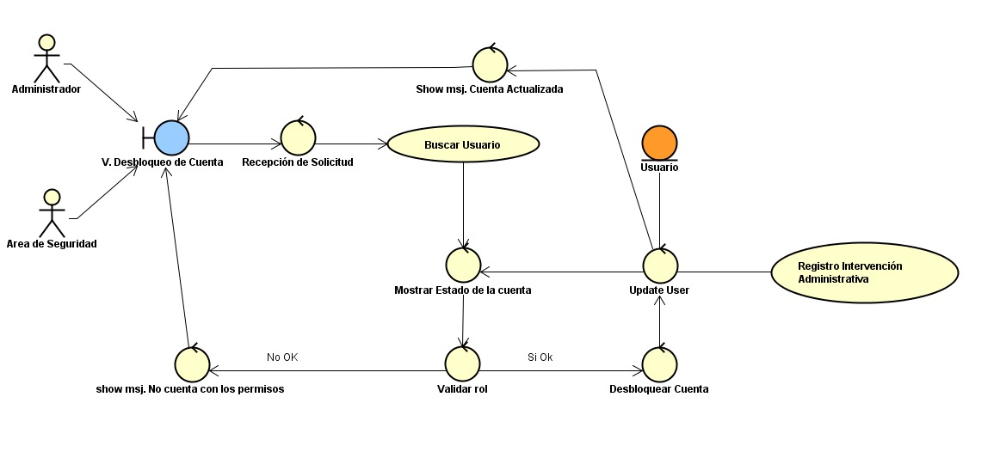

# CU-11: Desbloquear Cuenta

Caso de uso principal

## Actor(es)

Administrador del sistema, Área de seguridad

## Precondición

La cuenta del usuario se encuentra en estado "Bloqueada".

## Flujo principal

1. El actor incluye el caso de uso CU-02 (Buscar Usuario) para ubicar la cuenta bloqueada.
2. El sistema muestra el estado actual de la cuenta.
3. El actor solicita desbloquear la cuenta (RF-02).
4. El sistema cambia el estado de la cuenta a disponible para el acceso.
5. El sistema restablece el contador de intentos fallidos (RF-03).
6. El sistema incluye el caso de uso CU-18 (Registrar Intervención Administrativa).
7. El sistema informa al actor que la cuenta fue desbloqueada.

## Flujos alternativos

### A. Actor sin rol de administración (RF-28)

1. El sistema determina que el actor no posee el rol de administración.
2. El sistema rechaza la operación solicitada.
3. El sistema informa al actor que no cuenta con los permisos necesarios.
4. Finaliza el caso de uso.

## Postcondición

La cuenta queda disponible para el acceso normal y el contador de intentos fallidos queda en cero. La intervención administrativa queda registrada para auditoría.

## Relaciones

**Incluye:** [CU-02: Buscar Usuario](CU-02-buscar-usuario.md), [CU-18: Registrar Intervención Administrativa](CU-18-registrar-intervencion-administrativa.md)

## Requisitos y reglas que cubre

| Código | Descripción |
| --- | --- |
| RF-02 | El personal administrativo puede restablecer el acceso de una cuenta bloqueada. |
| RF-03 | Un inicio de sesión exitoso reinicia el contador de intentos fallidos. |
| RF-28 | Verificar que el actor posea el rol de administración antes de ejecutar cualquier operación administrativa. |

## Diseño

### Diagrama de casos de uso

*Diagrama 3: Administración de sesiones y recuperación de acceso*

### Diagrama de robustez

---
[← Volver al índice](../00-indice.md)
