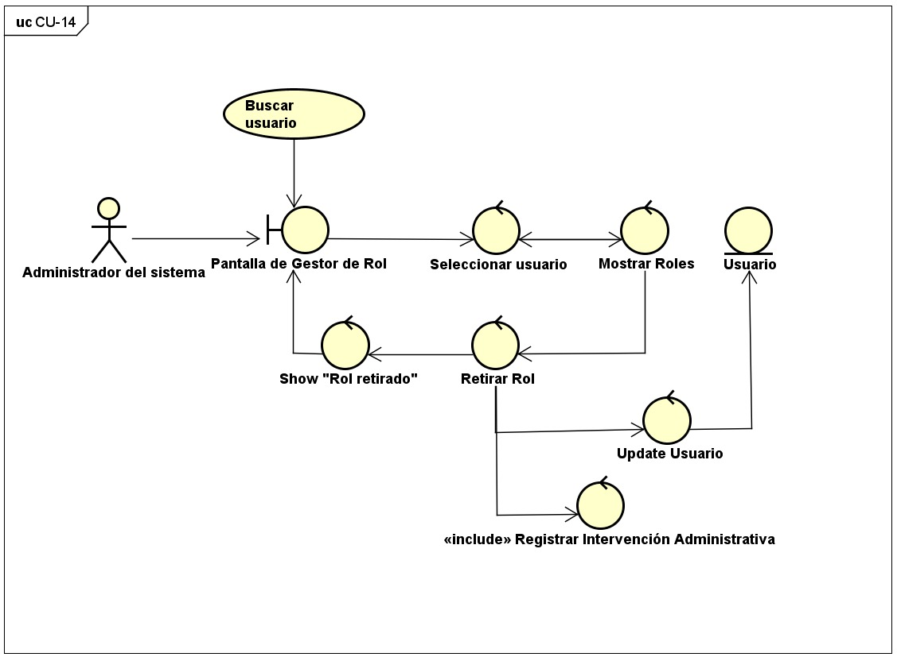
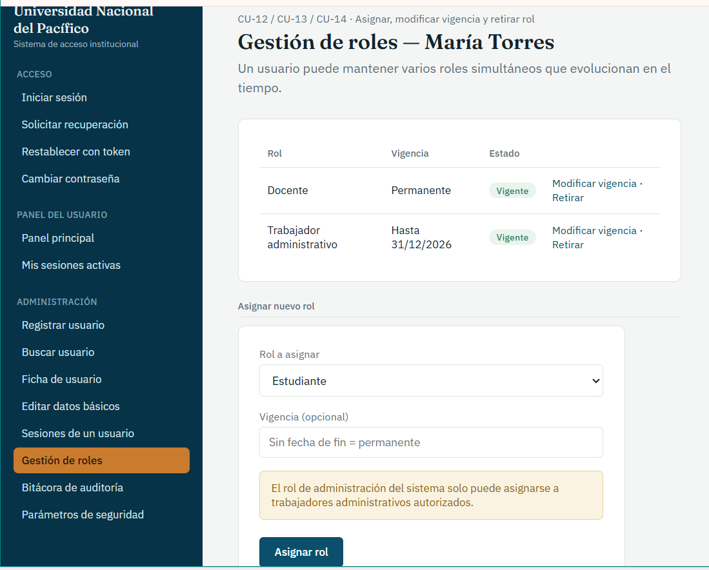

# CU-14: Retirar Rol de Usuario

Caso de uso principal

## Actor(es)

Administrador del sistema

## Precondición

El usuario cuenta con al menos un rol asignado vigente (CU-12).

## Flujo principal

1. El Administrador incluye el caso de uso CU-02 (Buscar Usuario) para ubicar al usuario.
2. El sistema muestra los roles asignados al usuario.
3. El Administrador selecciona el rol que desea retirar.
4. El sistema retira el rol seleccionado sin afectar la identificación básica del usuario (RF-21).
5. Los demás roles vigentes del usuario permanecen sin modificaciones.
6. El sistema incluye el caso de uso CU-18 (Registrar Intervención Administrativa).
7. El sistema confirma el retiro del rol.

## Postcondición

El rol seleccionado queda retirado. El usuario conserva los demás roles vigentes, si los tuviera. La identificación básica del usuario no se modifica.

## Relaciones

**Incluye:** [CU-02: Buscar Usuario](CU-02-buscar-usuario.md), [CU-18: Registrar Intervención Administrativa](CU-18-registrar-intervencion-administrativa.md)

## Requisitos y reglas que cubre

| Código | Descripción |
| --- | --- |
| RF-21 | Permitir asignar, cambiar o retirar roles sin modificar la identificación básica del usuario. |

## Diseño

### Diagrama de robustez

### Prototipo

*Gestión de roles.* Roles asignados con vigencia y estado (modificar vigencia, retirar) y asignación de un nuevo rol; aviso sobre la restricción del rol de administración.

---
[← Volver al índice](../00-indice.md)
