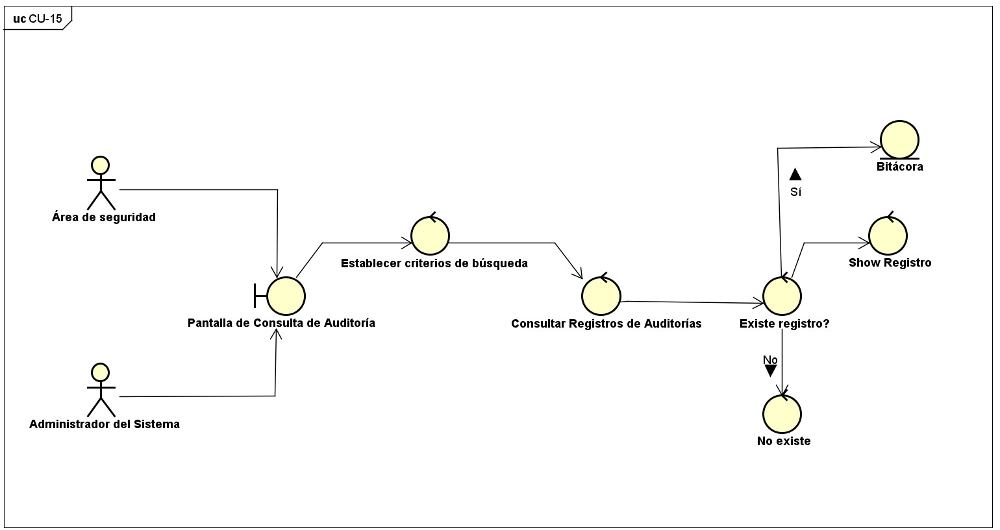

# CU-15: Consultar Bitácora de Auditoría e Historial

Caso de uso principal

## Actor(es)

Área de seguridad, Administrador del sistema

## Precondición

Existen registros de eventos almacenados previamente.

## Flujo principal

1. El actor accede al módulo de consulta de auditoría.
2. El sistema permite establecer criterios de búsqueda (RF-11).
3. El actor establece los criterios de consulta requeridos.
4. El sistema recupera los registros históricos que coinciden con los criterios establecidos.
5. El sistema muestra los registros encontrados: usuario, fecha y hora, resultado del intento, contexto y motivo de rechazo cuando corresponda.
6. El actor revisa la información obtenida (RF-26).

## Flujos alternativos

### A. No existen registros que coincidan

1. El sistema realiza la búsqueda solicitada.
2. El sistema determina que no existen registros que coincidan con los criterios establecidos.
3. El sistema informa al actor que no se encontraron registros.

## Postcondición

Los registros históricos permanecen almacenados sin ser modificados por la consulta realizada.

## Requisitos y reglas que cubre

| Código | Descripción |
| --- | --- |
| RF-11 | Permitir consultar y filtrar el historial de intentos de acceso por usuario, fecha, resultado y contexto. |
| RF-25 | Permitir que personal autorizado intervenga ante incidentes de acceso. |
| RF-26 | Permitir revisar el historial de accesos y actividades de un usuario en el contexto de un incidente. |

## Diseño

### Diagrama de casos de uso

*Diagrama 5: Auditoría y Configuración de Seguridad*

### Diagrama de robustez

### Prototipo

*Bitácora de auditoría.* Filtros por usuario, resultado y rango de fechas; tabla de intentos de acceso e intervenciones administrativas registradas.

---
[← Volver al índice](../00-indice.md)
