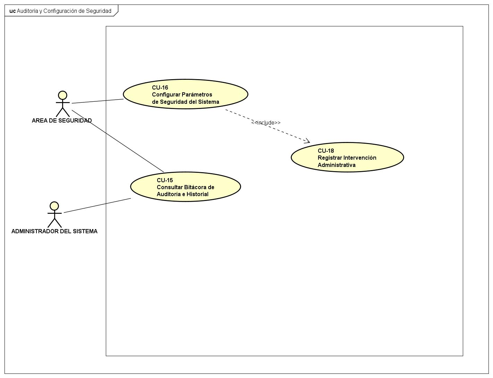
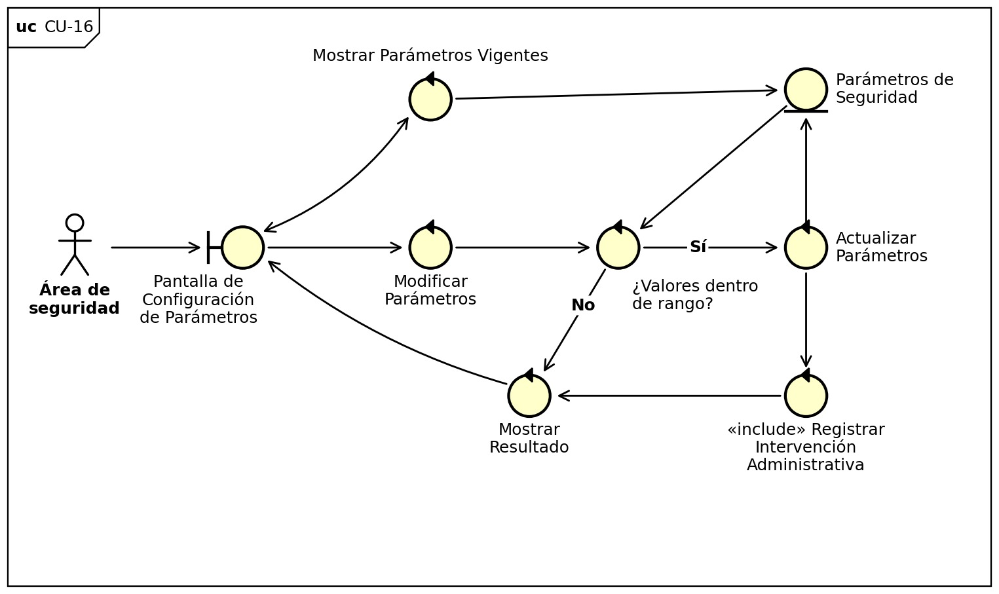
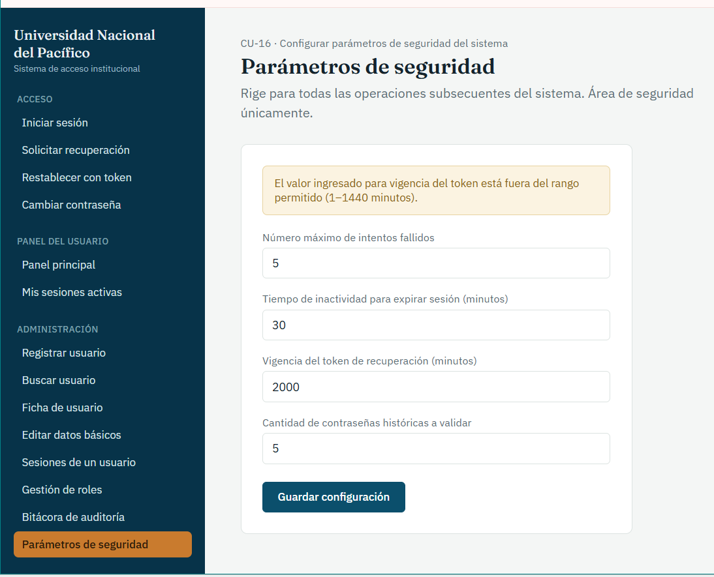

# CU-16: Configurar Parámetros de Seguridad del Sistema

Caso de uso principal

## Actor(es)

Área de seguridad

## Precondición

El actor posee permisos para configurar los parámetros de seguridad del sistema.

## Flujo principal

1. El actor accede al módulo de configuración de parámetros de seguridad.
2. El sistema muestra los valores vigentes de los parámetros configurables: número máximo de intentos fallidos (RF-01), tiempo de inactividad (RF-06), tiempo de vigencia del token de recuperación (RF-18) y cantidad de contraseñas históricas a validar (RF-14).
3. El actor modifica uno o varios parámetros.
4. El sistema valida que los valores ingresados se encuentren dentro de los rangos permitidos (RN-15).
5. El sistema actualiza los parámetros de configuración.
6. El sistema incluye el caso de uso CU-18 (Registrar Intervención Administrativa).
7. El sistema confirma la actualización al actor.

## Flujos alternativos

### A. Valor fuera de rango

1. El sistema determina que uno de los valores ingresados no cumple los rangos permitidos.
2. El sistema rechaza la actualización de ese parámetro.
3. El sistema informa al actor el rango válido esperado.
4. Los demás parámetros no modificados permanecen sin cambios.

## Postcondición

Los nuevos valores de configuración rigen para todas las operaciones subsecuentes del sistema. El cambio queda registrado para auditoría.

## Relaciones

**Incluye:** [CU-18: Registrar Intervención Administrativa](CU-18-registrar-intervencion-administrativa.md)

## Requisitos y reglas que cubre

| Código | Descripción |
| --- | --- |
| RF-01 | Limitar los intentos de autenticación fallidos y bloquear el acceso al superar el límite configurado. |
| RF-06 | Cada sesión se cierra de forma independiente por inactividad (no afecta las demás). |
| RF-14 | La cantidad de contraseñas históricas consideradas para el rechazo por reutilización debe ser configurable por el área de seguridad. |
| RF-18 | El token tendrá un tiempo de expiración definido. |
| RF-30 | Permitir que el área de seguridad configure el número máximo de intentos fallidos, el tiempo de inactividad para expiración de sesión, el tiempo de vigencia del token de recuperación y la cantidad de contraseñas históricas a validar, sin necesidad de modificar el código del sistema. |

## Diseño

### Diagrama de casos de uso

*Diagrama 5: Auditoría y Configuración de Seguridad*

### Diagrama de robustez

### Prototipo

*Parámetros de seguridad.* Número máximo de intentos, tiempo de inactividad, vigencia del token y contraseñas históricas; muestra el aviso de valor fuera de rango.

---
[← Volver al índice](../00-indice.md)
