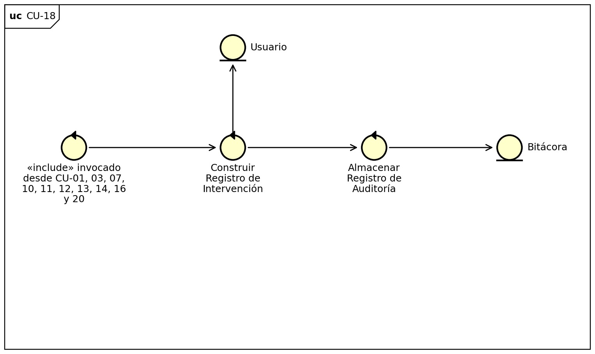

# CU-18: Registrar Intervención Administrativa

Caso de uso «include» (subrutina compartida)

## Actor(es)

Ninguno (caso de uso incluido; se ejecuta como parte de otro caso de uso administrativo).

## Precondición

El sistema ha verificado que el actor posee el rol de administración (RF-28) y ha ejecutado una acción administrativa.

## Flujo principal

1. El sistema registra quién ejecutó la acción, cuándo, sobre qué usuario y qué acción se realizó.
2. El sistema almacena el registro para fines de auditoría (RF-29, RN-14).

## Postcondición

La intervención administrativa queda registrada y disponible para su consulta posterior mediante CU-15.

## Relaciones

**Incluido por:** [CU-01: Registrar Usuario en el Sistema de Acceso](CU-01-registrar-usuario-en-el-sistema-de-acceso.md), [CU-03: Modificar Datos Básicos de Usuario](CU-03-modificar-datos-basicos-de-usuario.md), [CU-07: Cerrar Sesión de Usuario](CU-07-cerrar-sesion-de-usuario.md), [CU-10: Recuperar Acceso de Usuario](CU-10-recuperar-acceso-de-usuario.md), [CU-11: Desbloquear Cuenta](CU-11-desbloquear-cuenta.md), [CU-12: Asignar Rol a Usuario](CU-12-asignar-rol-a-usuario.md), [CU-13: Modificar Vigencia de Rol](CU-13-modificar-vigencia-de-rol.md), [CU-14: Retirar Rol de Usuario](CU-14-retirar-rol-de-usuario.md), [CU-16: Configurar Parámetros de Seguridad del Sistema](CU-16-configurar-parametros-de-seguridad-del-sistema.md), [CU-20: Deshabilitar Cuenta a Usuario](CU-20-deshabilitar-cuenta-a-usuario.md)

## Requisitos y reglas que cubre

| Código | Descripción |
| --- | --- |
| RF-29 | Registrar toda intervención administrativa (quién, cuándo, sobre qué usuario y qué acción) para fines de auditoría. |
| RNF-05 | Las operaciones administrativas deben estar desacopladas del mecanismo interno de acceso. |

## Diseño

### Diagrama de robustez

---
[← Volver al índice](../00-indice.md)
