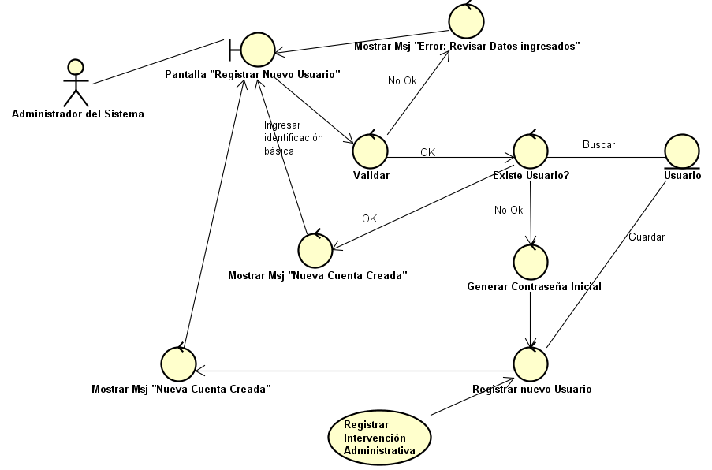
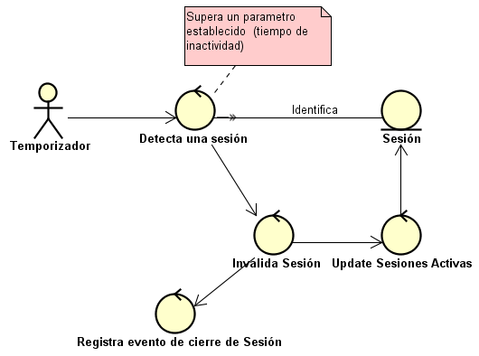
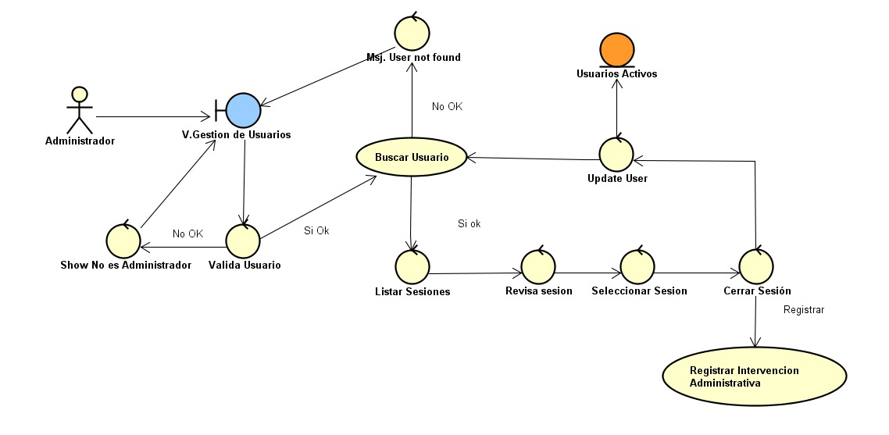
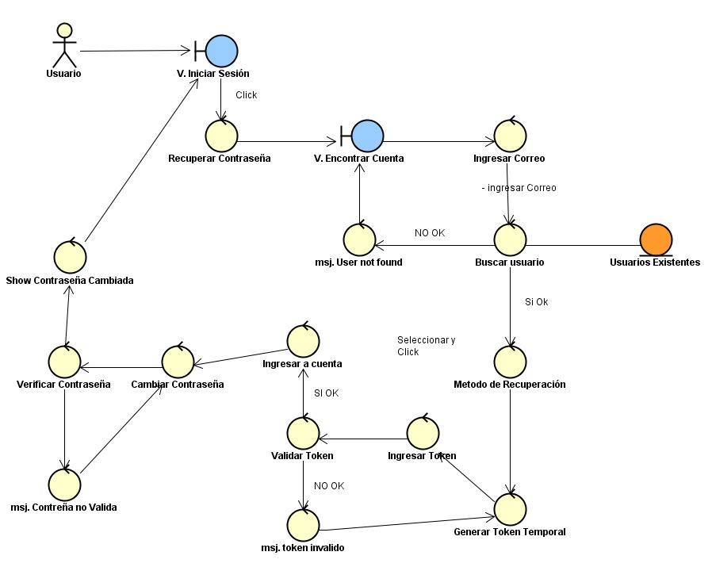
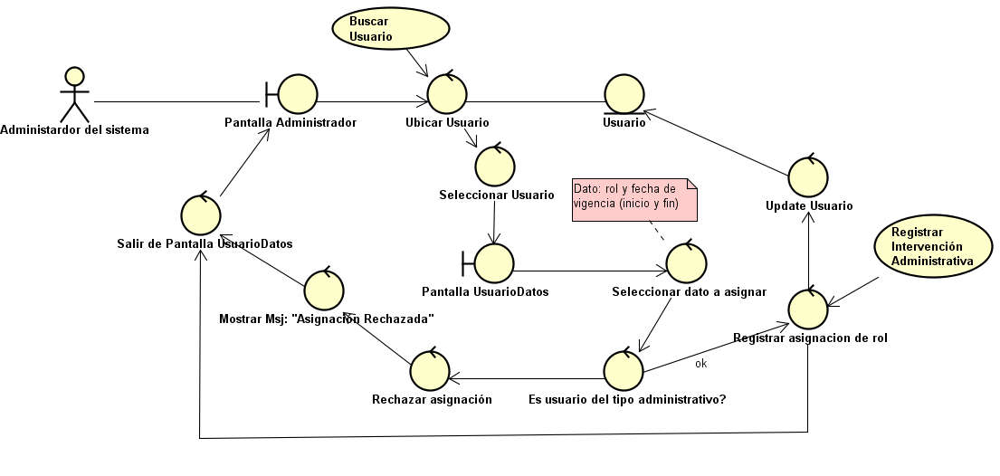
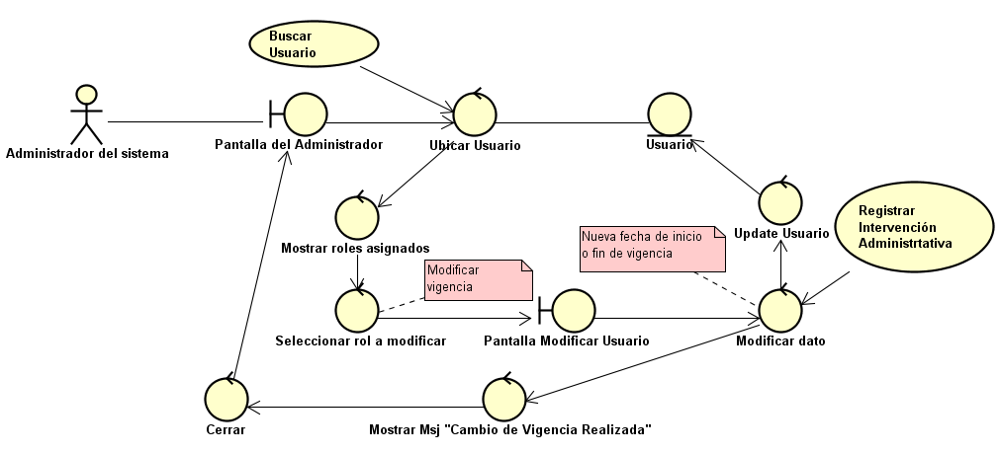
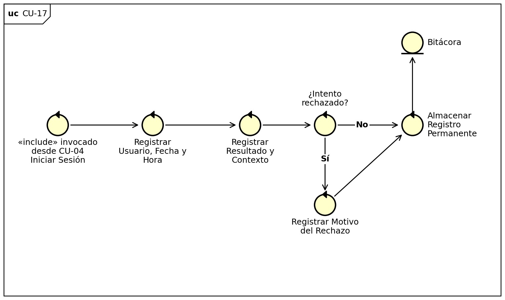
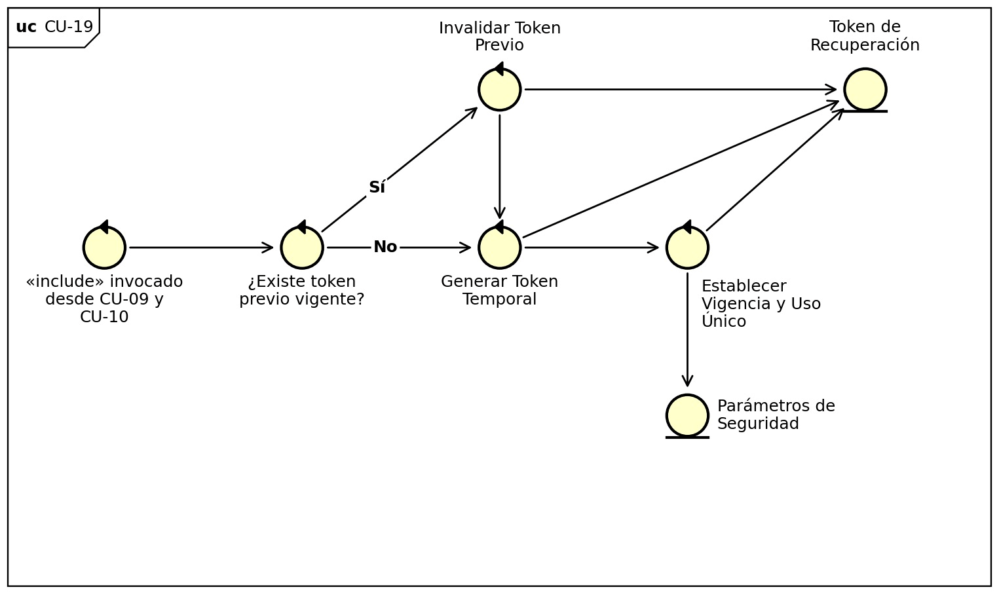
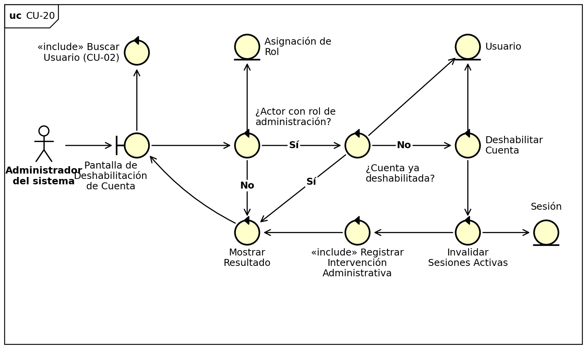

# Diagramas de robustez

Un diagrama por caso de uso, con los objetos de frontera (pantallas), control y entidad. Cada uno también aparece dentro del archivo del caso de uso correspondiente.

## [CU-01: Registrar Usuario en el Sistema de Acceso](../casos-de-uso/CU-01-registrar-usuario-en-el-sistema-de-acceso.md)

## [CU-02: Buscar Usuario](../casos-de-uso/CU-02-buscar-usuario.md)

## [CU-03: Modificar Datos Básicos de Usuario](../casos-de-uso/CU-03-modificar-datos-basicos-de-usuario.md)

## [CU-04: Iniciar Sesión](../casos-de-uso/CU-04-iniciar-sesion.md)

## [CU-05: Cerrar Sesión](../casos-de-uso/CU-05-cerrar-sesion.md)

## [CU-06: Cerrar Sesión por Inactividad](../casos-de-uso/CU-06-cerrar-sesion-por-inactividad.md)

## [CU-07: Cerrar Sesión de Usuario](../casos-de-uso/CU-07-cerrar-sesion-de-usuario.md)

## [CU-08: Cambiar Contraseña](../casos-de-uso/CU-08-cambiar-contrasena.md)

## [CU-09: Solicitar Recuperación de Acceso](../casos-de-uso/CU-09-solicitar-recuperacion-de-acceso.md)

## [CU-10: Recuperar Acceso de Usuario](../casos-de-uso/CU-10-recuperar-acceso-de-usuario.md)

*El Word aún no incluye el diagrama de robustez de este caso de uso.*

## [CU-11: Desbloquear Cuenta](../casos-de-uso/CU-11-desbloquear-cuenta.md)

## [CU-12: Asignar Rol a Usuario](../casos-de-uso/CU-12-asignar-rol-a-usuario.md)

## [CU-13: Modificar Vigencia de Rol](../casos-de-uso/CU-13-modificar-vigencia-de-rol.md)

## [CU-14: Retirar Rol de Usuario](../casos-de-uso/CU-14-retirar-rol-de-usuario.md)

## [CU-15: Consultar Bitácora de Auditoría e Historial](../casos-de-uso/CU-15-consultar-bitacora-de-auditoria-e-historial.md)

## [CU-16: Configurar Parámetros de Seguridad del Sistema](../casos-de-uso/CU-16-configurar-parametros-de-seguridad-del-sistema.md)

## [CU-17: Registrar Intento de Acceso](../casos-de-uso/CU-17-registrar-intento-de-acceso.md)

## [CU-18: Registrar Intervención Administrativa](../casos-de-uso/CU-18-registrar-intervencion-administrativa.md)

## [CU-19: Generar Token de Recuperación](../casos-de-uso/CU-19-generar-token-de-recuperacion.md)

## [CU-20: Deshabilitar Cuenta a Usuario](../casos-de-uso/CU-20-deshabilitar-cuenta-a-usuario.md)

---
[← Volver al índice](../00-indice.md)
