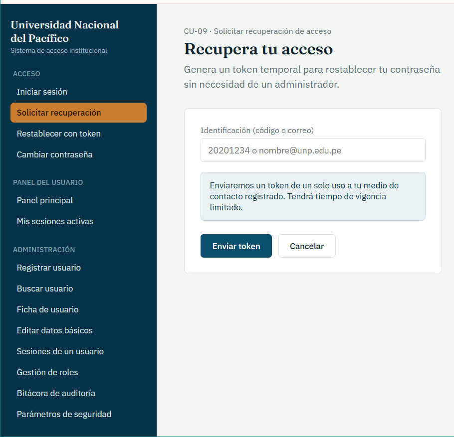
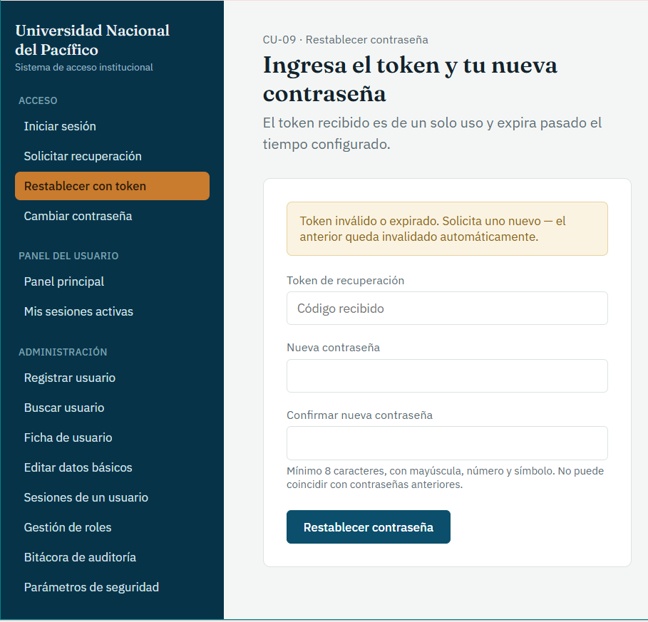
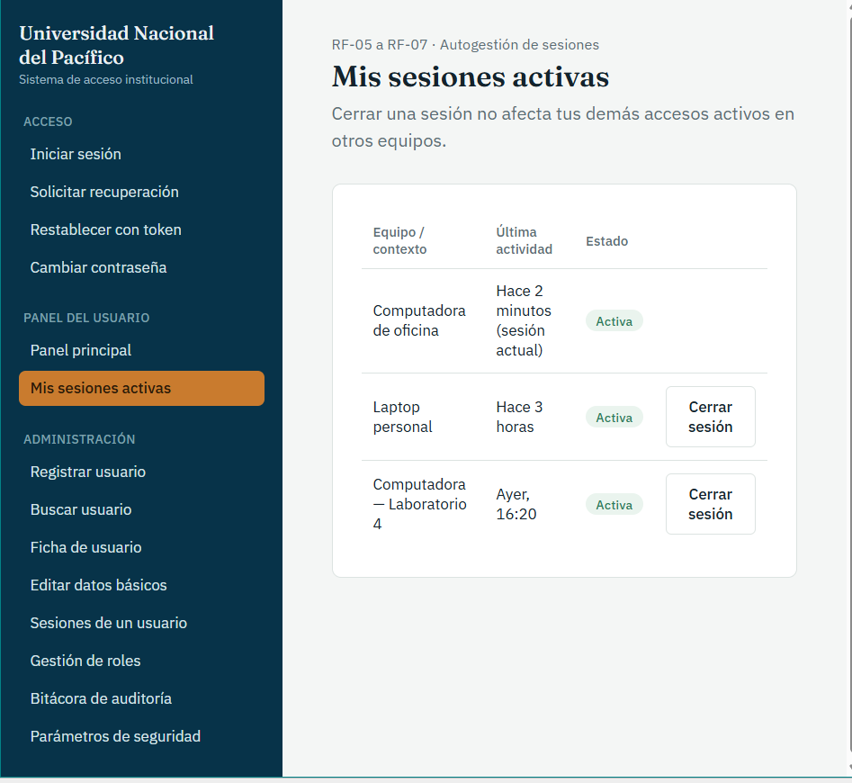
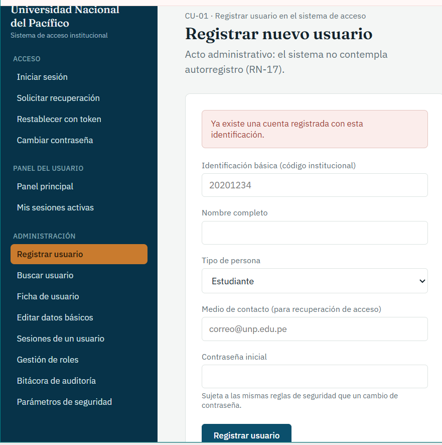
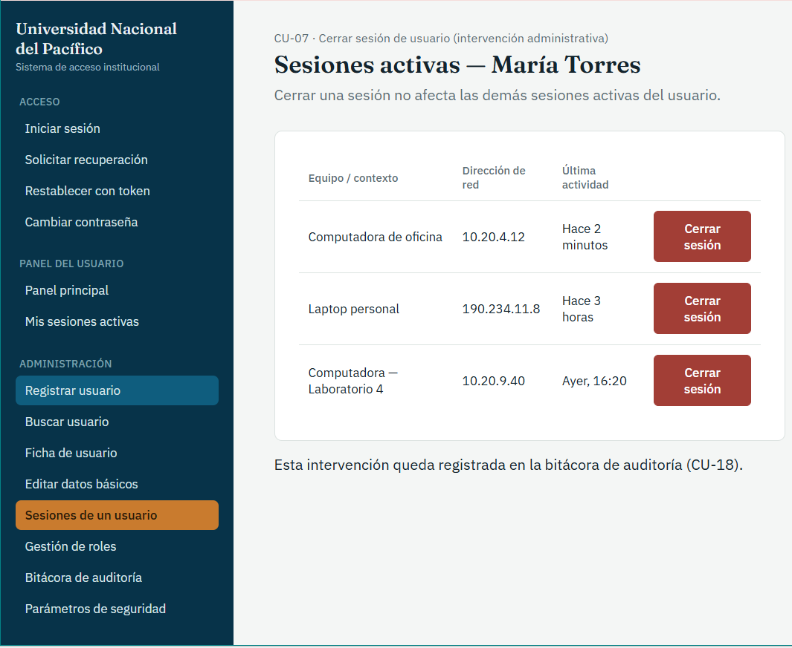
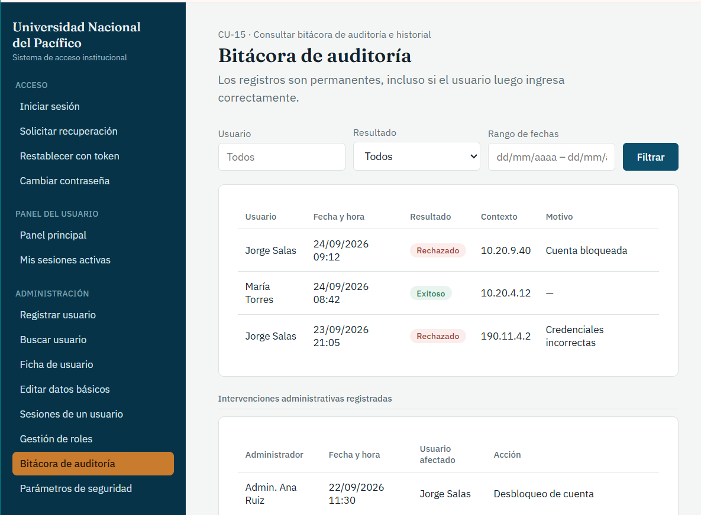

# Prototipo

Pantallas del prototipo del sistema, con el caso de uso al que corresponde cada una.

## Iniciar sesión

**Casos de uso:** [CU-04](../casos-de-uso/CU-04-iniciar-sesion.md)

Formulario de identificación y contraseña; se muestra el aviso de cuenta bloqueada al superar el número de intentos permitidos.

## Solicitar recuperación de acceso

**Casos de uso:** [CU-09](../casos-de-uso/CU-09-solicitar-recuperacion-de-acceso.md)

Solicitud de un token temporal de un solo uso, enviado al medio de contacto registrado.

## Restablecer contraseña con token

**Casos de uso:** [CU-09](../casos-de-uso/CU-09-solicitar-recuperacion-de-acceso.md)

Campos de token, nueva contraseña y confirmación; muestra el aviso de token inválido o expirado y la regla de contraseña (mínimo 8 caracteres, con mayúscula, número y símbolo).

## Cambiar mi contraseña

**Casos de uso:** [CU-08](../casos-de-uso/CU-08-cambiar-contrasena.md)

Contraseña actual, nueva y confirmación; muestra el aviso de contraseña ya utilizada anteriormente.

## Panel principal según rol vigente

**Casos de uso:** [CU-04](../casos-de-uso/CU-04-iniciar-sesion.md)

Muestra los roles vigentes del usuario y las opciones de servicio que le corresponden (RF-24).

## Mis sesiones activas

**Casos de uso:** [CU-05](../casos-de-uso/CU-05-cerrar-sesion.md)

Sesiones por equipo con última actividad y estado; permite cerrar las otras sesiones sin afectar la actual (RF-05 a RF-07).

## Registrar nuevo usuario

**Casos de uso:** [CU-01](../casos-de-uso/CU-01-registrar-usuario-en-el-sistema-de-acceso.md)

Identificación básica, nombre, tipo de persona, medio de contacto y contraseña inicial; muestra el aviso de identificación ya registrada.

## Buscar usuario

**Casos de uso:** [CU-02](../casos-de-uso/CU-02-buscar-usuario.md)

Búsqueda por identificación o nombre; tabla con roles vigentes y estado de la cuenta.

## Ficha de usuario

**Casos de uso:** [CU-02](../casos-de-uso/CU-02-buscar-usuario.md)

Datos del usuario en solo consulta y acciones derivadas: desbloquear cuenta (CU-11), editar datos básicos (CU-03), gestionar roles (CU-12/13/14), generar token de recuperación (CU-10) y deshabilitar cuenta (CU-20).

## Editar datos básicos

**Casos de uso:** [CU-03](../casos-de-uso/CU-03-modificar-datos-basicos-de-usuario.md)

Identificación (solo lectura), nombre y medio de contacto; muestra el aviso de formato inválido.

## Sesiones activas de un usuario

**Casos de uso:** [CU-07](../casos-de-uso/CU-07-cerrar-sesion-de-usuario.md)

Sesiones del usuario con equipo, dirección de red y última actividad; cierre individual; aviso de que la intervención queda en la bitácora (CU-18).

## Gestión de roles

**Casos de uso:** [CU-12](../casos-de-uso/CU-12-asignar-rol-a-usuario.md), [CU-13](../casos-de-uso/CU-13-modificar-vigencia-de-rol.md), [CU-14](../casos-de-uso/CU-14-retirar-rol-de-usuario.md)

Roles asignados con vigencia y estado (modificar vigencia, retirar) y asignación de un nuevo rol; aviso sobre la restricción del rol de administración.

## Bitácora de auditoría

**Casos de uso:** [CU-15](../casos-de-uso/CU-15-consultar-bitacora-de-auditoria-e-historial.md)

Filtros por usuario, resultado y rango de fechas; tabla de intentos de acceso e intervenciones administrativas registradas.

## Parámetros de seguridad

**Casos de uso:** [CU-16](../casos-de-uso/CU-16-configurar-parametros-de-seguridad-del-sistema.md)

Número máximo de intentos, tiempo de inactividad, vigencia del token y contraseñas históricas; muestra el aviso de valor fuera de rango.

---
[← Volver al índice](../00-indice.md)
